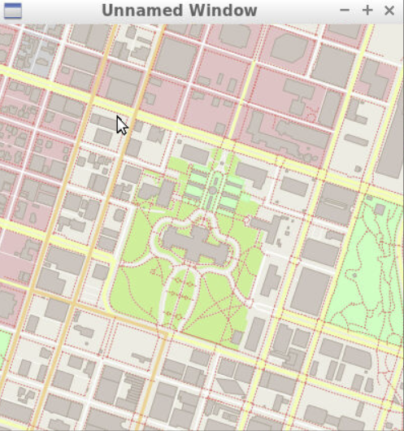
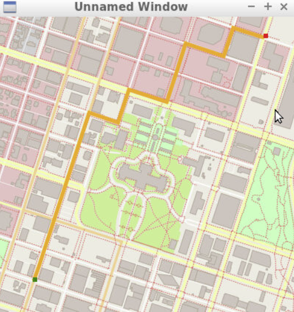

# Route Planning Project -- A finished Udacity project by Leda

## Udacity Original Repo

The link of original github repo is here. https://github.com/udacity/CppND-Route-Planning-Project  

Dependencies and compiling information are described in this original repo. 

This repo contains the starter code for the Route Planning project. The original map created looks like the figure below. 



## Things implemented and learned from this project

* ### A* search algorithm 
By implementing the A* search algorithm, I built a route planner in C++ that can find a path between any two points on a real map. 

* ###  C++ standard library
Data structures and algorithms are learnd by using the C++ standard library. 

* ###  Build tool(cmake and make) and head files
Build tool(cmake and make) and head files are used to compile and organize the project. 

* ###  Pointer, reference, and object-oriented programming
Pointer, reference, and object-oriented programming are also practiced. 

* ###  priority_queue 
Using priority_queue rather than sort to improve the efficiency of the searching algorith. 

when we are using a vector to keep track of all the visited nodes then we need to sort the vector multiple times to get the 
node with the minimum sum of g_value and h_value hence taking O(NlogN) time which is not very efficient.

However, when we use priority_queue then the node with the minimum/maximum (depends on the way you configure) value remains at the top of 
the heap and it takes O(1) to delete an element and keeping the order of the priority_queue the way you intended.

## Final Results

Using ```./test ``` to test the file. 

After the dependency is set up successfully, run ```./OSM_A_star_search ``` to find the path. 

The final route found by the program looks like the figure below. 




